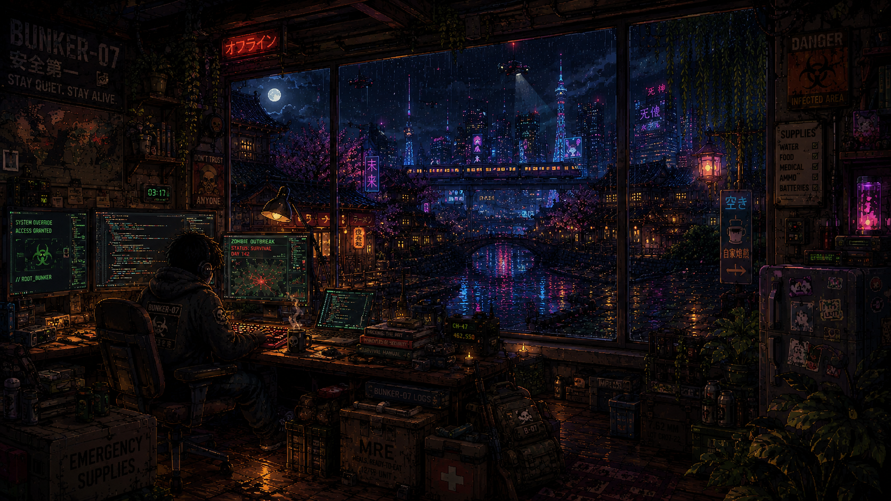
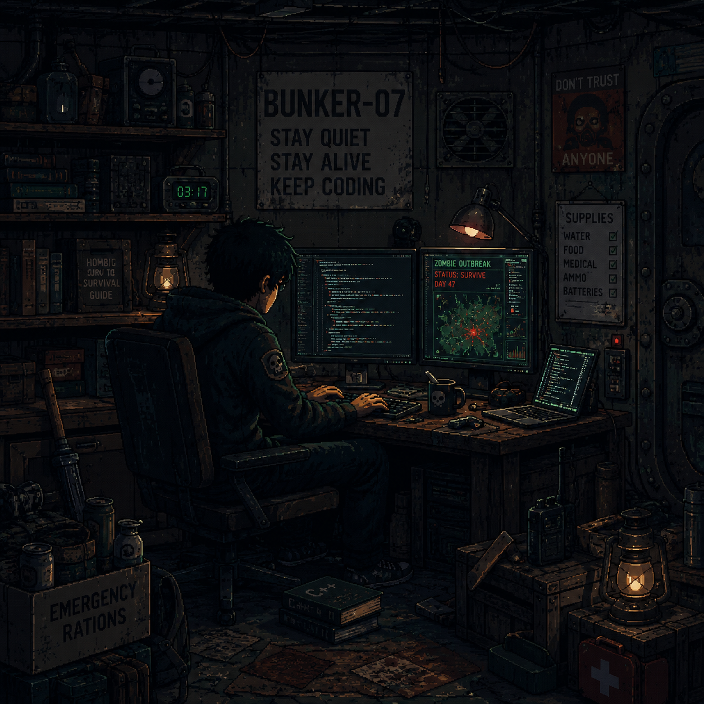
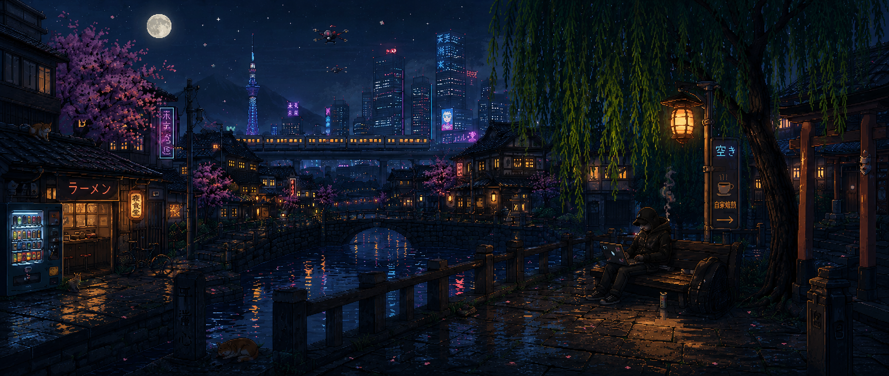

<!-- Top Header Banner Element -->

  

 

<!-- Live Profile Counters Matrix -->

  

  

  

  

 

<!-- Sidebar Picture & About Text Block -->

<h3 align="left">〄 Notes on Existence</h3>

  🌱 3rd-year Computer Science student. 
  💬 Interested in systems, code, and questions that don't have immediate answers. 
  🔐 Interested in understanding how things work beneath the surface. 
  ⚓ Maps are useful. The interesting parts are usually off them. 
  🔭 Not particularly interested in following predefined paths. 
  📡 Occasionally found beyond the intended use case. 
  ⚡ Passionate about automation and clean solutions. 
  🧭 Following curiosity more often than instructions.  
           
    ◈ The rest is still under investigation.

<!-- Float Break & Section Divider 1 -->
 

<!-- Social Media Handles Block -->
<h3 align="left" style="font-family: 'Courier New', Courier, monospace; font-weight: bold; text-transform: uppercase; letter-spacing: 2px;">⌘ Coordinates:</h3>

  
  
  
  
  

 

 

<!-- Section Divider 2 -->

<!-- Tech Stack Grid Element -->
 
<h3 align="center">📚 Languages & Tools I Have Placed My Hands On</h3>

   

<!-- Section Divider 3 -->

<!-- Main Repository Activity Statistics -->
<h3 align="center">🌱 GitHub Status</h3>

   

 

<!-- Repository Language Breakdown Chart -->

  

 

<!-- Commit/Contribution History Chart -->

  

<!-- Section Divider 4 -->

<!-- Custom Blockquote Quote Element -->
<blockquote align="center">
  <strong>✍️ Dev Quote:</strong> 
  "Every worthwhile project begins the same way : with a question nobody asked and a decision nobody recommended."
</blockquote>

 

<!-- Footer Banner & System Warning Element -->

 
    

  
    

  ⚠️ Built during moments of curiosity and poor decisions.

